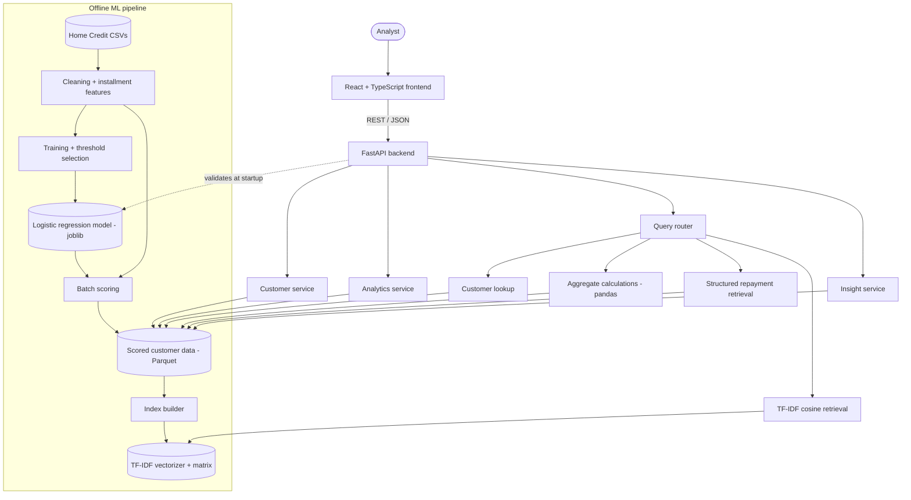
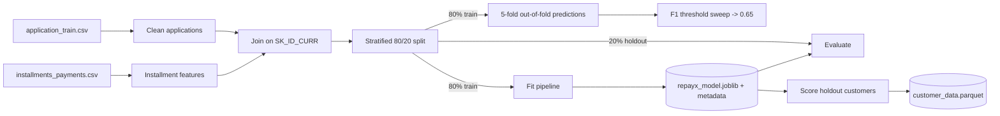
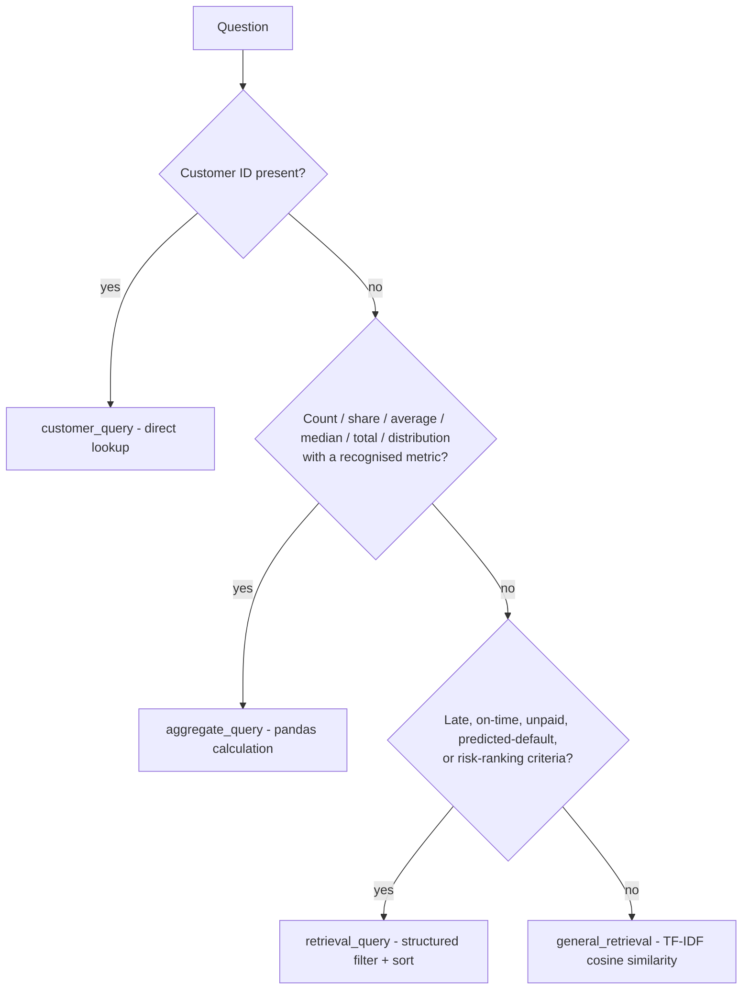

# RepayX

**AI-powered loan risk and recovery intelligence platform**

RepayX estimates each borrower's risk of default with a machine-learning model, analyses their historical repayment behaviour, and lets analysts explore the portfolio through a dashboard and natural-language questions. Every number in the interface is computed from the scored dataset by the backend; nothing is hard-coded.

> RepayX provides model-based risk estimates for analytical and demonstration purposes. Risk scores are not guaranteed outcomes and should not be treated as a final lending decision.

---

## Contents

1. [Project overview](#1-project-overview)
2. [Problem statement](#2-problem-statement)
3. [Features](#3-features)
4. [Architecture](#4-architecture)
5. [Tech stack](#5-tech-stack)
6. [ML pipeline](#6-ml-pipeline)
7. [Feature engineering](#7-feature-engineering)
8. [Hybrid RAG architecture](#8-hybrid-rag-architecture)
9. [API endpoints](#9-api-endpoints)
10. [Frontend architecture](#10-frontend-architecture)
11. [Project structure](#11-project-structure)
12. [Installation](#12-installation)
13. [Running the frontend](#13-running-the-frontend)
14. [Running the backend](#14-running-the-backend)
15. [Dataset information](#15-dataset-information)
16. [Model evaluation](#16-model-evaluation)
17. [Example queries](#17-example-queries)
18. [Limitations](#18-limitations)
19. [Future improvements](#19-future-improvements)

Also: [Testing](#testing) · [Security and data privacy](#security-and-data-privacy) · [Product requirements (PRD.md)](PRD.md) · [Backend notes](backend/README.md)

---

## 1. Project overview

RepayX combines four things in one application:

- **Default-risk prediction.** A logistic-regression model trained on the Home Credit Default Risk data estimates each customer's probability of default. The probability becomes a 0–100 risk score and a Low / Medium / High risk category.
- **Repayment analytics.** Historical installment records are aggregated into per-customer behaviour: lateness, underpayment, unpaid amounts, and payment ratio.
- **Portfolio dashboard.** Risk and repayment distributions, segment breakdowns, and ranked customer tables, all served by a FastAPI backend.
- **Natural-language questions.** A hybrid query router answers questions such as *"How many high-risk customers are there?"* or *"Which customers frequently pay late?"*. Numeric questions are calculated with pandas; only descriptive questions use TF-IDF text retrieval. No language model writes the answers.

The scored portfolio is the 20% held-out split of the training data: **61,503 customers** that the model never saw while training.

## 2. Problem statement

Lenders and collections teams need to know which borrowers are most likely to default and why, early enough to act. In practice:

- Application data and repayment history live in separate tables, so risk is judged without behavioural context.
- Dashboards are often static, show figures nobody can trace back to data, or mix model output with outcomes in ways that leak information.
- Analysts who are not data specialists cannot easily ask questions of the portfolio, and generic AI chatbots answer numeric questions unreliably.

RepayX addresses this with one pipeline from raw data to scored customers, an API that computes every figure on request from that data, and a question interface that routes each question to a method that can answer it correctly.

## 3. Features

| Area | What it does |
|---|---|
| Risk scoring | Estimated default probability, risk score (probability × 100), risk category, and a predicted-default flag at the 0.65 classification threshold |
| Dashboard | Customer totals by risk category, risk-score histogram, default-probability overview, repayment metrics, late-payment-rate distribution, highest-risk customers |
| Risk analytics | Risk by income type, education, and occupation; highest default probabilities; model evaluation |
| Repayment analytics | Late payment rates by segment; highest late-payment rates; largest unpaid amounts |
| Customers | Searchable, filterable (All / Low / Medium / High), sortable, paginated table; filters live in the URL |
| Customer details | Financial profile, customer profile, repayment history, risk position meter, repayment comparison with portfolio averages, and a rule-based AI Insight with risk indicators |
| AI Insights | Natural-language questions answered by the hybrid query router, with the query type, the answer, and results as metric cards, customer cards, or a customer table |
| Error handling | Clear states for loading, empty results, invalid or unknown customer IDs, unavailable backend, missing data/model/index, and invalid responses; no stack traces reach the user |
| Demo workflow | The original recovery-workflow screens (loans, conversations, follow-ups, payments, escalations, reports) are kept under *Demo workflow*. They use sample data and are labelled as such. |

## 4. Architecture



Design principles:

- **Numbers are calculated, never retrieved.** Counts, averages, and totals come from pandas over the customer data. TF-IDF is used only for descriptive questions.
- **Load once, serve from memory.** The model, the customer data, and the TF-IDF index are loaded and validated once when the backend starts.
- **Thin routes, logic in services.** API routes validate input and delegate to services under `backend/services/`.
- **Consistency is enforced.** The backend refuses customer data scored by a different model version, and a TF-IDF index built from different customer data. The model's checksum, scikit-learn version, and input columns must match its metadata.
- **No outcomes in the serving path.** The actual default label (`TARGET`) is used only for training and evaluation. The scoring step and the index builder refuse data that contains it, and the backend rejects any customer file with an outcome column.

## 5. Tech stack

| Layer | Technologies |
|---|---|
| Frontend | React 19, TypeScript, Vite 8, React Router 7, Tailwind CSS 4, Recharts 3, Lucide icons |
| Backend | Python 3.12+ (tested on 3.14), FastAPI, Uvicorn, Pydantic |
| ML and data | pandas, NumPy, scikit-learn 1.9.1, SciPy, joblib, PyArrow |
| Retrieval | scikit-learn `TfidfVectorizer`, cosine similarity on a sparse matrix (NPZ) |
| Storage | Parquet (customer data), joblib (model, vectorizer), NPZ (TF-IDF matrix) |
| Testing and CI | pytest, Vitest, Testing Library, GitHub Actions |

There is no database: the prototype serves a fixed, pre-scored dataset from memory.

## 6. ML pipeline



1. **Cleaning** (`ml/preprocessing/preprocessing.py`). The `DAYS_EMPLOYED` placeholder value 365243 becomes missing and gets a flag. `XNA` categories become missing. Ratio features are derived: credit ÷ income, annuity ÷ income, annuity ÷ credit, goods price ÷ credit, and employment ÷ age.
2. **Installment features** (`ml/features/installment_features.py`). See [section 7](#7-feature-engineering).
3. **Preprocessing pipeline.** Numeric features: median imputation, then `StandardScaler`, with money amounts log-transformed first. Categorical features: a constant "MISSING" fill, then `OneHotEncoder` (rare levels grouped). The pipeline uses only built-in scikit-learn components, so loading the model never depends on project code.
4. **Model.** `LogisticRegression(class_weight="balanced")` on 54 input features: 46 numeric and 8 categorical.
5. **Threshold selection.** A 5-fold out-of-fold F1 sweep on the training split only selected **0.65**, matching the value in the specification. The holdout is never used for tuning.
6. **Outputs.** `risk_score = default_probability × 100`. Risk categories are prototype presentation bands: **Low < 30, Medium 30–60, High ≥ 60**. `predicted_default` is 1 when the probability is ≥ 0.65. The threshold and the bands are separate concepts.
7. **Excluded inputs.** `CODE_GENDER` and `NAME_FAMILY_STATUS` are protected attributes in many lending regimes and are not model inputs. Family status is still shown on customer profiles.

Commands (run from the repository root): `python -m ml.training.train_model`, `python -m ml.evaluation.evaluate_model`, `python -m ml.scoring.score_customers`, and `python -m ml.retrieval.build_tfidf_index`.

## 7. Feature engineering

About 5% of installments in `installments_payments.csv` are paid in several rows, and each row repeats the full `AMT_INSTALMENT`. Computing features row by row would count the small top-up payment as "underpaid" by almost the whole amount and double-count totals. RepayX therefore first collapses rows to **one record per installment** (`SK_ID_PREV`, `NUM_INSTALMENT_VERSION`, `NUM_INSTALMENT_NUMBER`): the scheduled amount, the sum of payments, the due day, and the day of the last payment.

Per installment:

| Feature | Definition |
|---|---|
| `DAYS_LATE` | `DAYS_ENTRY_PAYMENT − DAYS_INSTALMENT` |
| `DAYS_LATE_POSITIVE` | `max(DAYS_LATE, 0)` |
| `IS_LATE` | `DAYS_LATE > 0` (unknown when no payment was recorded) |
| `IS_UNDERPAID` | shortfall > 0.01 (absorbs floating-point noise) |
| `UNPAID_AMOUNT` | the shortfall when underpaid, else 0 |

Per customer (`SK_ID_CURR`):

`INSTALLMENT_COUNT`, `TOTAL_INSTALLMENT_AMOUNT`, `TOTAL_PAYMENT_AMOUNT`, `AVG_INSTALLMENT_AMOUNT`, `AVG_PAYMENT_AMOUNT`, `LATE_PAYMENT_COUNT`, `AVG_DAYS_LATE`, `MAX_DAYS_LATE`, `UNDERPAID_COUNT`, `TOTAL_UNPAID_AMOUNT`, `LATE_PAYMENT_RATE` (late ÷ installments with a known payment date), `UNDERPAID_RATE`, and `PAYMENT_RATIO` (paid ÷ due).

Missing history is not treated as good history. Customers without installment records (5.2% of the scored portfolio) keep missing repayment values plus a `HAS_INSTALLMENT_HISTORY = 0` flag. The API returns `null` for them, the UI shows "—", and portfolio averages exclude them.

## 8. Hybrid RAG architecture

`route_repayx_query(query)` (`backend/services/query_router.py`) classifies each question with deterministic rules, in this priority order:



- **Customer IDs always win.** *"How many late payments does customer 385772 have?"* is a customer query, not an aggregate. Numbers that read as amounts or thresholds (*"over 100000"*, *"₹250000"*) are not mistaken for IDs.
- **Filters combine with every route:** a risk category (*high risk*), profile values (*pensioners*, *laborers*, *married*), numeric thresholds (*unpaid amounts over 100000*, *late rate above 50%*), and limits (*top 5*, at most 50).
- **Structured retrieval sorting:** late payers by `LATE_PAYMENT_RATE`, then `AVG_DAYS_LATE`; unpaid amounts by `TOTAL_UNPAID_AMOUNT`; risk by `risk_score`.
- **General retrieval.** Each customer is described by a short text document built from the served customer data: risk category, predicted default, profile fields, and descriptive repayment wording such as *frequent late payments*. The vectorizer uses word unigrams and bigrams with sublinear TF; there are 61,503 documents and 268 terms. Results below 0.05 cosine similarity are dropped. The documents never contain outcomes, and TF-IDF is never used for numeric questions.
- **Answers are generated from computed values** and always state the population they cover, for example *"across 58,318 customers (3,185 without a known value excluded)"*.

## 9. API endpoints

Base URL: `http://localhost:8000`. Interactive documentation is at `/docs`.

| Method | Path | Description |
|---|---|---|
| GET | `/api/health` | `ok` / `degraded`, plus the status of each artifact (`available` / `missing` / `invalid`) and the model version |
| GET | `/api/customer/{customer_id}` | Full profile, rule-based `insight` (summary and indicators), portfolio `benchmarks`, and the classification threshold. Returns `404` for unknown customers. |
| GET | `/api/customers` | Paginated summaries. Parameters: `page`, `page_size` (≤ 100), `risk_category`, `search` (customer ID or prefix, digits only), `sort_by`, `sort_order` |
| GET | `/api/analytics` | Portfolio metrics, repayment statistics, risk-score histogram, late-rate buckets, segment breakdowns, model evaluation, and the disclaimer |
| POST | `/api/query` | Body `{"query": "..."}` (1–500 characters). Returns `query_type`, `result`, and `customer` / `customers` / `metrics` as relevant |

Units: `default_probability`, `late_payment_rate`, and `underpaid_rate` are percentages (0–100). `risk_score` is 0–100. `payment_ratio` is paid ÷ due (1.0 = paid in full).

Errors use one envelope: `{"success": false, "error": {"code": "...", "message": "...", "details": [...]}}`. Status codes: `422` for invalid input (the input is never echoed back), `404` for unknown customers or routes, `503` when data, model, or index is unavailable, and `500` with a generic message.

Example:

```bash
curl http://localhost:8000/api/customer/385772
curl "http://localhost:8000/api/customers?risk_category=High%20Risk&sort_by=late_payment_rate&page_size=5"
curl -X POST http://localhost:8000/api/query -H "Content-Type: application/json" \
     -d '{"query": "How many high-risk customers are there?"}'
```

```json
{
  "success": true,
  "query": "How many high-risk customers are there?",
  "query_type": "aggregate_query",
  "result": "There are 12,646 High Risk customers, 20.56% of the 61,503 scored customers.",
  "model_version": "repayx-logreg-20261005064635",
  "metrics": [
    {"name": "customer_count", "label": "Number of High Risk customers", "value": 12646, "unit": "count", "population": 61503},
    {"name": "share_of_portfolio", "label": "Share of portfolio", "value": 20.56, "unit": "percent", "population": 61503}
  ]
}
```

## 10. Frontend architecture

| Route | Page | Data |
|---|---|---|
| `/` | Dashboard | `/api/analytics`, `/api/customers` |
| `/analytics/risk` | Risk Analytics | `/api/analytics`, `/api/customers` |
| `/analytics/repayment` | Repayment Analytics | `/api/analytics`, `/api/customers` |
| `/customers` | Customer table (filters stored in the URL) | `/api/customers` |
| `/customers/:customerId` | Customer details | `/api/customer/{id}` |
| `/insights` | AI Insights (question in `?q=`) | `POST /api/query` |
| `/demo/*`, `/loans`, `/conversations`, … | Demo workflow pages | sample data only |

- **`src/services/api.ts`** is a typed client. It reads `VITE_API_BASE_URL` (never a hard-coded host) and adds timeouts, cancellation, response-shape checks, and typed error kinds (`config`, `network`, `timeout`, `not_found`, `validation`, `unavailable`, `server`, `invalid_response`).
- **`src/hooks/`** contains `useCustomers`, `useCustomer`, `useAnalytics`, and `useRepayxQuery`. They handle loading, error, and retry, keep the previous data while refetching, and cancel requests that are no longer needed.
- **`src/pages/`** holds the route pages, which are lazy-loaded. Components live in `components/analytics`, `components/customers`, `components/rag`, and `components/common`.
- **Charts** follow a validated palette. The risk colours (Low `#2a78d6`, Medium `#c98500`, High `#b8322f`) pass colour-blind separation and contrast checks. Every chart has a legend, hover tooltips, and a table view, and severity labels always pair an icon with a word.

## 11. Project structure

```
RepayX/
├── backend/
│   ├── api/                 # FastAPI app, routes, error handling
│   ├── services/            # customer, analytics, insight, query router/service, TF-IDF retrieval, model engine
│   ├── models/schemas.py    # Pydantic request/response schemas
│   ├── tests/               # pytest (fixtures; real-data tests skip without artifacts)
│   ├── data/                # customer_data.parquet (generated, git-ignored)
│   ├── rag/                 # TF-IDF artifacts (generated, git-ignored)
│   ├── config.py · run.py · requirements*.txt · README.md
├── ml/
│   ├── preprocessing/       # application cleaning, feature lists, sklearn preprocessor
│   ├── features/            # installment feature engineering
│   ├── training/            # train_model.py
│   ├── evaluation/          # metrics, evaluate_model.py
│   ├── scoring/             # risk outputs, score_customers.py
│   ├── retrieval/           # customer documents, build_tfidf_index.py
│   ├── tests/               # pytest
│   └── config.py · data.py · model_io.py · requirements*.txt
├── models/                  # repayx_model.joblib + metadata + evaluation report (committed)
├── datasets/                # Home Credit CSVs (download; git-ignored)
├── frontend/
│   ├── src/pages · components · hooks · services · types · lib · test
│   └── package.json · vite.config.ts · tsconfig.json · index.html
├── notebooks/ · rag/        # reserved placeholders (empty); the TF-IDF index lives in backend/rag/
├── .github/workflows/ci.yml
├── Loan payments data.csv · loan_data_set.csv   # original datasets, not used by the pipeline (see section 15)
├── PRD.md · README.md · .env.example · .gitignore
```

## 12. Installation

Prerequisites: Git, **Node.js 22.12+** with npm, and **Python 3.12+**.

```bash
git clone https://github.com/priyaparihar2006/RepayX.git
cd RepayX
cp .env.example .env              # read by Vite (VITE_API_BASE_URL); backend defaults work without it
```

Backend and ML environment (one virtual environment serves both, so their scikit-learn versions always match):

```bash
cd backend
python -m venv .venv
# Windows: .venv\Scripts\activate    macOS/Linux: source .venv/bin/activate
pip install -r requirements-dev.txt
cd ..
```

Data and artifacts. The trained model is committed; the customer data and the index must be generated:

1. Download [Home Credit Default Risk](https://www.kaggle.com/competitions/home-credit-default-risk/data) (a Kaggle account is required). Copy `application_train.csv`, `application_test.csv`, and `installments_payments.csv` into `datasets/`.
2. From the repository root, with the virtual environment active:

```bash
python -m ml.scoring.score_customers       # backend/data/customer_data.parquet (61,503 holdout customers)
python -m ml.retrieval.build_tfidf_index   # backend/rag/ index files
```

Optional: to retrain, run `python -m ml.training.train_model` (about 5 minutes; it writes a new model version) and `python -m ml.evaluation.evaluate_model`, then re-run the two commands above. The backend rejects customer data or an index produced by a different model version.

Frontend:

```bash
cd frontend
npm install
```

## 13. Running the frontend

```bash
cd frontend
npm run dev        # http://localhost:3000
npm run lint       # TypeScript check
npm test           # Vitest suite
npm run build      # production build in dist/
```

Vite reads `VITE_API_BASE_URL` from the repository-root `.env` (`envDir`). Without it, API pages show a configuration message.

## 14. Running the backend

```bash
cd backend
python run.py      # http://127.0.0.1:8000, docs at /docs
pytest             # backend tests
```

Settings come from environment variables (listed in `.env.example`; the backend does not read the `.env` file itself): `API_HOST`, `API_PORT`, and `CORS_ALLOWED_ORIGINS` (defaults: `http://localhost:3000` and `http://127.0.0.1:3000`). Optional artifact path overrides are listed there too. Check `GET /api/health`: `status: ok` means the model, customer data, and index all loaded and validated. Missing pieces show as `missing` or `invalid`, and only the features that need them return `503`.

## 15. Dataset information

**Home Credit Default Risk** (Kaggle competition data; not redistributed in this repository):

| File | Rows | Use |
|---|---|---|
| `application_train.csv` | 307,511 applications, 8.07% default rate (`TARGET` = 1) | training, evaluation, and the scored holdout |
| `installments_payments.csv` | 13,605,401 payment rows (12,951,918 installments; 339,587 customers) | repayment features |
| `application_test.csv` | 48,744 applications, no labels | optional scoring population (`--population application_test`) |

The scored portfolio is the stratified 20% holdout of `application_train.csv` (61,503 customers; 58,321 with installment history). Raw data, the scored Parquet file, holdout IDs, and the TF-IDF index are git-ignored. Recreate them with the pipeline in [section 12](#12-installation). The Kaggle competition rules govern use of the data.

The two CSVs that shipped with the original prototype (`Loan payments data.csv`, 500 loans; `loan_data_set.csv`, 614 applications) are kept unchanged. They have no loan IDs in common, describe different borrowers, and lack the installment fields RepayX needs, so the pipeline does not use them.

## 16. Model evaluation

Holdout of 61,503 customers (8.07% defaults), evaluated once and then independently reproduced by `ml.evaluation.evaluate_model`:

| Metric | Threshold 0.65 (used) | Threshold 0.50 |
|---|---|---|
| Accuracy | 83.5% | 69.7% |
| Precision | 22.6% | 16.4% |
| Recall | 43.4% | 67.4% |
| F1 | 29.8% | 26.4% |
| ROC-AUC | 75.3% | 75.3% |
| PR-AUC (average precision) | 23.4% | 23.4% |

At 0.65 the confusion matrix is 2,155 true positives, 7,368 false positives, 2,810 false negatives, and 49,170 true negatives. The original prototype's reported figures (accuracy 69.4%, precision 16.4%, recall 68.3%, F1 26.5%, ROC-AUC 75.3%) correspond to the 0.50 threshold and are reproduced closely.

Risk bands separate observed default rates as intended:

| Risk category | Customers | Observed default rate |
|---|---|---|
| Low Risk (< 30) | 20,465 | 2.1% |
| Medium Risk (30–60) | 28,392 | 6.9% |
| High Risk (≥ 60) | 12,646 | 20.5% |

ROC-AUC is 0.752 for customers with installment history and 0.765 for those without. These are prototype results on public competition data, not a production validation.

## 17. Example queries

All answers below come from the real scored data:

| Question | Type | Answer (abridged) |
|---|---|---|
| What is the risk status of customer 385772? | customer | High Risk, risk score 80.13/100, predicted default: yes; 3 installments, all late (100%), 4.33 days late on average, 0.22 unpaid |
| How many high-risk customers are there? | aggregate | 12,646 High Risk customers, 20.56% of 61,503 |
| What is the average late payment rate? | aggregate | 8.52% across 58,318 customers (3,185 without a known value excluded) |
| Which customers frequently pay late? | retrieval | 30,946 customers with a late payment, sorted by late rate, then days late |
| Show customers with unpaid amounts. | retrieval | 621 customers, sorted by unpaid amount (largest 1,040,230.57) |
| What is the average risk score of pensioners? | aggregate | 34.34 across 11,228 pensioners |
| How many customers have a 100% late payment rate? | aggregate | 52 customers |
| What percentage of customers are predicted to default? | aggregate | 9,523 of 61,503 (15.48%) |
| Show customers with unpaid amounts over 100000 | retrieval | 22 customers |
| married drivers with higher education | general (TF-IDF) | Customers whose profiles match, with similarity scores |

## 18. Limitations

- **The model is a prototype.** It is a linear model on application and installment data only; bureau, previous applications, and card balances are not used. Precision at 0.65 is 22.6%, so most predicted defaults do not default. Do not use it for lending decisions.
- **Probabilities are estimates.** Class weighting raises predicted probabilities above the 8% base rate (portfolio average 41.8%), so treat scores as rankings rather than calibrated frequencies.
- **Bands and threshold are not validated policy.** The 30/60 risk bands are presentation choices. The 0.65 threshold maximises F1 on the training split, not a business cost function. The insight rules (50% late, 30 days late, payment ratio 0.9) are descriptive review rules.
- **The data is static.** The portfolio is a fixed historical snapshot scored offline; nothing updates in real time, and there are no real loans, names, or collections actions.
- **Query routing is rule-based.** The router recognises the phrasings in [section 8](#8-hybrid-rag-architecture). Unrecognised wording falls back to TF-IDF text matching, which is lexical, not semantic.
- **There is no authentication or user management.** The API is meant for local or trusted-network use.
- **Some recovery-workflow pages are demos.** They use sample data and simulate actions.

## 19. Future improvements

- Add bureau, previous-application, and card features; compare gradient-boosted models; calibrate probabilities (Platt or isotonic).
- Choose the threshold from a cost matrix (missed default vs unnecessary intervention) rather than F1.
- Add per-customer explanations (feature contributions) to the AI Insight.
- Add fairness monitoring across segments and drift monitoring for scored populations.
- Score new applications through an API endpoint, versioning models and datasets with an experiment tracker.
- Add semantic retrieval alongside TF-IDF, and optional LLM phrasing grounded in computed results.
- Add authentication, role-based access, and audit logging; containerised deployment.
- Connect the recovery-workflow pages to real loan and collections data.

---

## Testing

| Suite | Command | Count |
|---|---|---|
| Backend | `cd backend && pytest` | 190 tests, plus 8 real-data acceptance tests that run when the artifacts exist |
| ML | `cd ml && pytest` | 29 |
| Frontend | `cd frontend && npm test` | 39 |

The suites use fixtures and a fake API, so they need neither the dataset nor a running server. GitHub Actions (`.github/workflows/ci.yml`) runs all of them, plus the frontend lint and build, on pushes to `main` and `repayx-fullstack` and on pull requests.

## Security and data privacy

- No secrets are required or stored. `.env` is git-ignored, and `.env.example` contains only local defaults.
- CORS allows only the configured frontend origins.
- All input is validated: customer IDs, query length (1–500 characters), and list parameters. Validation errors do not echo input back.
- Errors never expose stack traces, exception text, or file paths; paths appear only in server logs.
- Model and index files are checked against SHA-256 checksums before they are loaded.
- Actual outcomes (`TARGET`) never appear in API responses, customer data, or retrieval documents.

## License

This project is intended for internal/company use. Add the organization's official license and usage terms here if applicable. The Home Credit dataset is subject to the Kaggle competition rules and is not included.

## Project

**RepayX: AI-Powered Loan Risk & Recovery Intelligence Platform**, by Priya Parihar.
